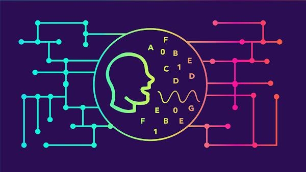

# Natural Language Processing
by [Amanda Oliveira](https://www.linkedin.com/in/amanda-guedes-de-oliveira-0776366a/)

#### **Goals for this project**

The use of natural language processing has exploded over the last decade. Applications that require machines to understand natural human speech patterns are abundant and substantial improvements in these systems has increased their utility. Within the educational space NLP is used to interpret human speech for the prupose of understanding human problems and recently an online tutor passed a limited version of the [Turing Test](https://en.wikipedia.org/wiki/Turing_test) when it was [indistinguishable from teaching assistants in a college class](http://www.news.gatech.edu/2017/01/09/jill-watson-round-three).

In a first application I will process a set of documents, run a sentiment analysis and then generate topic models of those documents. The documents I will be using will be student notes that the class HUDK4050 at TC/Columbia made during the Fall/2020. 

A similar analysis will be run for a set of articles collected from the NYT website in pdf format. More details about those applications can be found in the accompanying .Rmd and .html files. 

#### **Resources**

###### **Readings**

[Nadkarni, P. M., Ohno-Machado, L., & Chapman, W. W. (2011). Natural language processing: An Introduction. Journal of the American Medical Informatics Association: JAMIA, 18(5), 544–551.](http://www.ncbi.nlm.nih.gov/pmc/articles/PMC3168328/)

[Robinson, A. C. (2015). Exploring Class Discussions from a Massive Open Online Course (MOOC) on Cartography. In J. Brus, A. Vondrakova, & V. Vozenilek (Eds.), Modern Trends in Cartography (pp. 173–182). Springer International Publishing.](http://link.springer.com.ezproxy.cul.columbia.edu/chapter/10.1007/978-3-319-07926-4_14)

[McNamara, D. S., Crossley, S. A., & Roscoe, R. (2013). Natural Language Processing in an Intelligent Writing Strategy Tutoring System. Behavior Research Methods, 45(2), 499–515.](http://link.springer.com.ezproxy.cul.columbia.edu/article/10.3758/s13428-012-0258-1)

###### **Videos**

[Introduction to NLP](https://youtu.be/MKUcElLffTg)

[Video Slide Deck](https://github.com/la-process-and-theory/natural-language-processing/blob/master/nlp-slides.pdf)

[Crash Course. (2017). Natural Language Processing.](https://www.youtube.com/watch?v=fOvTtapxa9c)

[Raval, S. (2016). Sentiment Analysis in 4 Minutes.](https://www.youtube.com/watch?v=AJVP96tAWxw)

[Knispelis, A. (2016). LDA Topic Models.](https://www.youtube.com/watch?v=3mHy4OSyRf0)

